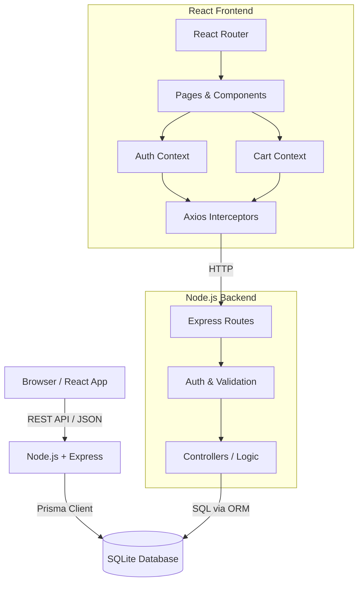

# ShopSmart

A production-grade, full-stack e-commerce application equipped with a React frontend, Node.js + Express backend, SQLite database (managed by Prisma ORM), and comprehensive automated testing.

## Tech Stack

| Domain | Technologies |
|---|---|
| **Frontend** | React, React Router, Context API, Vite, Axios |
| **Backend** | Node.js, Express, Prisma ORM, JSON Web Tokens (JWT), bcryptjs |
| **Database** | SQLite |
| **Testing** | Vitest, Testing Library (Frontend), Jest, Supertest (Backend), Playwright (E2E) |
| **DevOps** | GitHub Actions, PM2, Dependabot |

## Architecture



## Features
- **User Authentication**: Secure JWT-based login and registration with bcrypt password hashing
- **Product Catalog**: Browse products with search, category filtering, and sorting
- **Shopping Cart**: Add, update, and remove items with real-time stock validations
- **Order Management**: Checkout process and comprehensive order history viewing
- **Responsive UI**: Modern, accessible, mobile-first design system with dark mode support

## Getting Started Locally

### Prerequisites
- Node.js (v18+)

### 1. Backend Setup
```bash
cd server
npm install
cp .env.example .env
npx prisma generate
npx prisma migrate dev --name init
node prisma/seed.js
npm run dev
```

### 2. Frontend Setup
In a new terminal:
```bash
cd client
npm install
npm run dev
```

Visit `http://localhost:5173` to view the application.

## CI/CD & Infrastructure

The project utilizes a modern, automated CI/CD pipeline orchestrated via **GitHub Actions** and **Terraform**:

- **Phase 1: Automated Testing**: Triggered on every push. It runs Jest (backend) and Vitest (frontend) to ensure 100% logic coverage before proceeding.
- **Phase 2: Infrastructure as Code (IaC)**: Uses **Terraform** to provision a secure AWS environment including an S3 Bucket, ECR Repository, and ECS Cluster.
- **Phase 3: Containerization**: Builds a multi-stage **Docker** image optimized for production (Node-Alpine) and pushes it to Amazon ECR.
- **Phase 4: Serverless Deployment**: Deploys the container to **AWS ECS Fargate**, providing a highly scalable and maintenance-free execution environment.

## Advanced DevOps Features

- **Non-Root Security**: The container runs as a dedicated `node` user to prevent privilege escalation.
- **Dynamic Provisioning**: Terraform uses random suffixes and data sources to navigate student account restrictions and naming collisions.
- **Automated Health Checks**: Docker health checks are integrated with ECS to ensure zero-downtime and automatic recovery from crashes.

## Deployment Steps (AWS EC2)

1. **Provision EC2**: Launch an Ubuntu instance on AWS, opening ports `80`, `443`, and `5001`.
2. **Install Environments**: SSH in and install Node 20+, PM2, and git.
3. **Setup Repository**: Clone this repository into `/app/shopsmart`.
4. **Environment Variables**: Create the `.env` file inside `/app/shopsmart/server`.
5. **Start PM2**: Run `pm2 start ecosystem.config.js` to begin serving the Node API and serving the React static build via the `serve` module.
6. **Configure GitHub Secrets**: Add `EC2_HOST`, `EC2_USERNAME`, and `EC2_SSH_KEY` to the repository secrets for automated actions.

## Challenges & Solutions

**Challenge**: Keeping the cart state instantly synchronized for the user while preventing race conditions when checking out (e.g. buying an item that just went out of stock).
**Solution**: Leveraged React Context for optimistic UI updates coupled with Prisma `$transaction` operations on the backend. The backend validates real-time stock levels right before a transaction commits, safely rolling back and returning a descriptive 400 error message if stock is insufficient.

**Challenge**: Implementing secure auth across distinct frontend and backend servers.
**Solution**: Designed a robust Axios API client using interceptors to automatically attach the stored JWT to the headers of outbound requests. Added a global 401 response interceptor to instantly securely clear local storage and redirect to the login page whenever a token expires or is deemed invalid.
